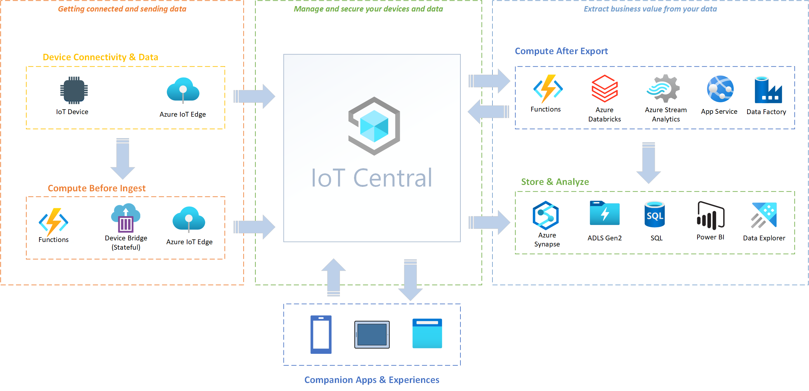
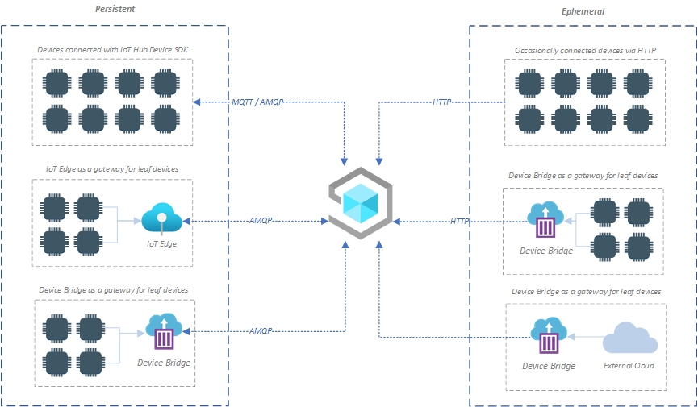
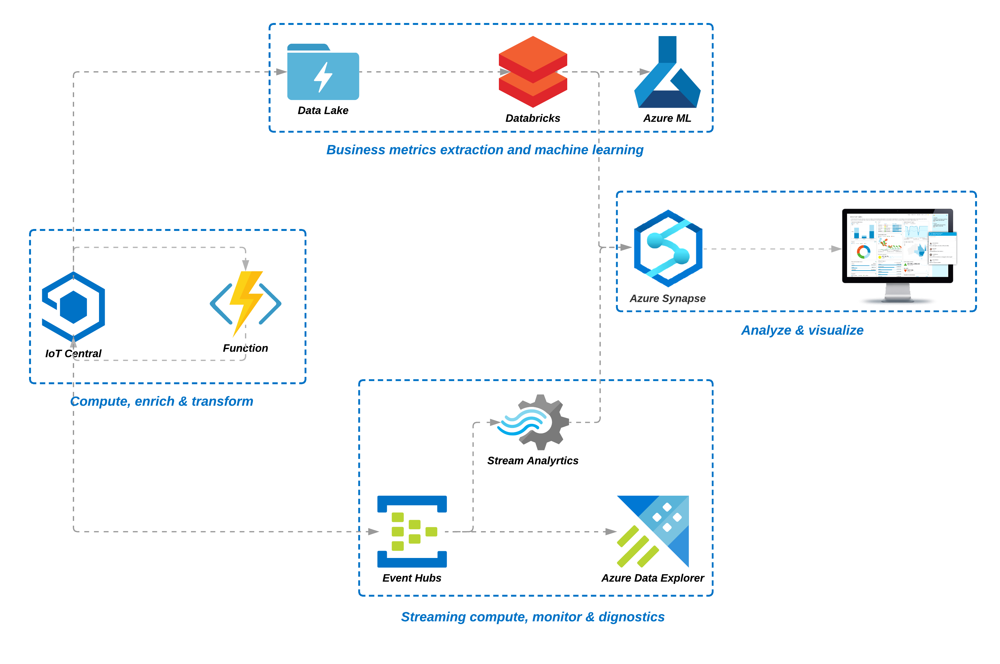
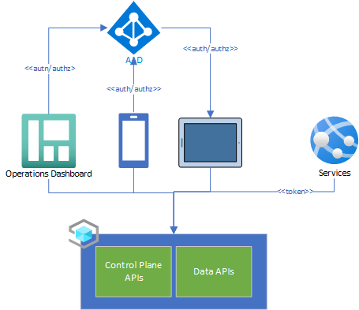

- [Introduction](#introduction)
- [Scenarios](#scenarios)
  - [Getting connected and sending data](#getting-connected-and-sending-data)
    - [Getting Connected](#getting-connected)
      - [Persistent](#persistent)
      - [Ephemeral](#ephemeral)
    - [Transform and custom computation](#transform-and-custom-computation)
    - [Guides and samples](#guides-and-samples)
  - [Extract business value from IoT data](#extract-business-value-from-iot-data)
    - [Guides and samples](#guides-and-samples-1)
  - [Companion apps & experiences](#companion-apps--experiences)
    - [Guides and samples](#guides-and-samples-2)

# Introduction

Azure IoT Central provides a rich, easy to use IoT Application platform providing rich functionality to accelerate your overall IoT Solution. While IoT Central provides many built in features that help reduce the burden and cost of developing, managing connected IoT devices. IoT Central also exposes a set of rich extensibility and integration points that allow you to leverage IoT Central's features and capabilities in your overall IoT Solutions architecture to accelerate and derive business value / insights in your overall IoT Solution.

This guide provides insights into various tried & tested, production capable patterns and samples that you can to integrate IoT Central as part of your overall IoT Solution architecture.

# Scenarios

## Getting connected and sending data
IoT Central provides various connectivity options for connecting your devices to IoT Central. For most scenarios that that have devices capable of utilizing IoT Hub device SDKs, please check IoT Central's [device connectivity documentation](https://docs.microsoft.com/en-us/azure/iot-central/core/concepts-get-connected) in IoT Central.

### Getting Connected
Device connectivity patterns in general fall under two broad categories:

#### Persistent 
Persistent device connectivity scenarios are where a persistent connection is desirable from the device to the cloud for command and control scenarios. Persistent connections maintain a network connection to the cloud and re-connect whenever there is a disruption to the connected client on the device. Persistent connections allow the cloud to issue command and control messages to the device in near realtime. Common persistent connection protocols supported by IoT Central are MQTT and AMQP. 

IoT Central provides various options to support persistent device connectivity:
- **Connect devices and transmit data using IoT Hub Device SDKs**:

  IoT Central natively supports device clients using IoT Hub device SDKs, whether the device utilizes MQTT or AMQP/ws to connect to the IoT Hub. For extensive guides and samples on how to get started on connecting your devices using IoT Hub SDK to IoT Central, check out the [device connectivity documentation](https://docs.microsoft.com/en-us/azure/iot-central/core/concepts-get-connected) in IoT Central documentation.

- **Connect devices over local network to IoT Edge and transmit data to IoT Central**:

  IoT Central natively supports IoT Edge out of the box. For devices that are not capable of communicating over the broader web or when your scenario requires network isolation of downstream leaf devices, utilizing an IoT Edge device as a gateway device allows for transmission of device data from IoT Edge to IoT Central. Since connection from IoT Edge to IoT Central is persistent, supporting command and control of downstream leaf devices is also possible by utilizing IoT Edge.

- **Connect devices using custom protocol using IoT Central Device Bridge**:

  For existing devices that may utilize custom protocols or encoding not natively supported by IoT Central, such as LWM2M/COAP, you can utilize IoT Central Device Bridge as a translator to transmit downstream device data to IoT Central. Since the connection maintained by IoT Central Device Bridge is persistent, you can also command and control devices connected via IoT Central Device Bridge from IoT Central.

#### Ephemeral
Ephemeral device connectivity scenarios are where a connection is briefly made to transmit data captured by a device to the cloud. Once the data is transmitted, the connection to the cloud is terminated and connection is re-established for transmitting data the next time. Since the connection is ephemeral, this type of device connectivity should be utilized where command and control of the devices are not required.

IoT Central provides various options to support ephemeral device connectivity:
- **Connect devices and transmit data using standard HTTP API calls**:

  IoT Central natively supports devices utilizing HTTP to transmit data to IoT Hub. Utilize the IoT Hub REST API guide to transmit telemetry data from the device to IoT Central directly. See the IoT Hub documentation on [sending device event](https://docs.microsoft.com/en-us/rest/api/iothub/device/senddeviceevent) using REST API for more details.

  > Note: When transmitting data to IoT Central via HTTP directly, you must provision your device via DPS to ensure that the device is provisioned and registered with IoT Central. 

- **Connect downstream devices using Azure IoT Central Device Bridge (stateless)**:
  
  Azure IoT Central Device bridge can also be deployed as an Azure Function that accepts incoming telemetry data as HTTP requests and transmits the data to IoT Central. Azure IoT Central Device Bridge provides native integration with Azure IoT Hub Device Provisioning service, so prior provisioning of the devices are not required. Devices can simply route their telemetry requests to Azure IoT Central Bridge, and the bridge will take care of ensuring that the device has been successfully provisioned in IoT Central.

- **Connect external clouds using Azure IoT Central Device Bridge (stateless)**:
  
  For IoT Solutions currently integrated with other IoT clouds such as Sigfox, Particle or The Things Network (TTN), you can utilize Azure IoT Central Device Bridge to forward messages from other IoT Clouds to IoT Central.

See the [Device connectivity patterns and scenarios](#device-connectivity-patterns-and-scenarios) section that contains samples and guides for getting devices connected, sending data, command and control devices connected to IoT Central.

### Transform and custom computation
Many IoT scenarios may require augmenting the data being sent from IoT devices with auxiliary information from external systems or stores before the data is ingested into IoT Central, allowing the augmented data to be used when leveraging IoT Central features. 

Some scenarios may also require transformations of data before ingested into IoT Central, especially when migrating existing devices that may be using data encoded in a legacy or unsupported format.

To support such scenarios, IoT Central provides the following options to perform custom transform or computation before ingesting data into IoT Central:

- **Perform custom transform and computations using IoT Edge**:
  
  IoT Edge can be leveraged to perform custom transforms and computation using custom edge modules. IoT Edge is applicable when your devices are already capable of communicating via Azure IoT Hub SDKs

- **Perform custom transform and computations using Azure IoT Central Device Bridge**:
  
  IoT Central Device Bridge can also be leveraged to perform transform and custom computations by leveraging IoT Central Device Bridge adapters.

### Guides and samples
Below are some guides, samples and utilities you can leverage for exploring various device connectivity patterns with IoT Central described above:

- **[IoT Central Web MQTT Device]([Something](https://github.com/iot-for-all/iot-central-web-mqtt-device))**
  
  This repository provides a fully functional sample of a device using a persistent connection in a web browser. This sample be used for scenarios where a device needs to connect over a browser environment.

- **[IoT Central Batch Telemetry with Python](https://github.com/iot-for-all/iot-central-batch-telemetry-with-python)**

  This repository contains a sample that can be used for occasionally connected devices using ephemeral connectivity pattern, and send a batch of telemetry to IoT Central via HTTP.

- **[IoT Central SDK for MicroPython](https://github.com/iot-for-all/iotc-micropython-client)**

  This repository contains the source for a MicroPython client SDK that is capable of connecting to IoT Central. Use this library for leveraging MicroPython on your device. 

- **[Phone as a Device](https://github.com/iot-for-all/iotc-paad)**

  This repository contains a sample of a phone client that connects to IoT Central device telemetry from the phone and allow controlling the device via IoT Central.

- **[IoT Central Python Sample](https://github.com/iot-for-all/Iot_Central_Python_Sample)**

  This repository contains a sample device that connects and communicates with IoT Central using the Azure IoT native python client.

- **[Continuous Patient Monitoring Sample](https://github.com/iot-for-all/iotc-cpm-sample)**

  This repository contains a sample where a phone can be used as a gateway allowing downstream BLE devices to connect with IoT Central.

- **[IoT Central Twin Viewer](https://github.com/iot-for-all/iotc-twinviewer)**

  This repository contains a utility web app that you can use to connect a device in a web environment, visualize the TWIN for the device and interact with IoT Central by updating the device twin and visualize updates to the twin via IoT Central.

## Extract business value from IoT data

IoT data provides an opportunity for driving insight and innovation across many business boundaries, and IoT Central provides a rich platform that helps accelerate extracting business value from your IoT data. While IoT Central provides many built-in features that you can leverage out of the box to gain insights and take action on your IoT data, however many IoT solution scenarios require a more controlled or specialized set of business processes to execute over captured IoT data. 

- **Compute, enrich & transform**
  
  While IoT Central allows capturing, managing and visualizing IoT data , often times it is beneficial to enrich / transform the captured IoT Data with external data sources and feed that back into IoT Central to help manage and visualize your devices.

  For e.g. IoT Central's continuous export feature can be utilized to trigger an external Azure function to perform custom enrichment of a captured device telemetry and push the enriched data back into IoT Central, honoring timestamps.

- **Extracting business metrics & AI/ML**
  
  IoT data can be leveraged to calculate business metrics such as Overall Equipment Effectiveness (OEE) and Overall Process Effectiveness (OPE). Additionally, IoT Data can enrich your existing assets in AI/ML, helping reduce the time and complexity of capturing the data required to model, train and deployment of your trained models.

  E.g. you can leverage IoT Central's continuous data export feature to publish captured IoT data into a Azure data lake connected to Azure Databricks for computing OEE & OPE, as well as pipe the same data to Azure ML / Azure Synapse leveraging their machine learning capabilities. 

- **Streaming computation, monitor & diagnostics**

  IoT Central provides a scalable, reliable and performance infrastructure to capture streaming data from millions of connected devices. Often times, custom stream computations are required over the hot / warm IoT data to meet business requirements. Additionally, IoT data can be merged with other operational data in external historian stores such as Azure Data explorer to provide deep / rich diagnostic capabilities.

- **Analyze & visualize IoT data alongside business data**

  While IoT Central provides feature rich dashboards and visualizations, often times business specific reports require merging of IoT data along with various existing business data sourced from external systems. You can leverage IoT Central's integration features to extract IoT data captured by IoT Central and merge with existing business data to provide a central solution for analyzing / visualizing you business processes. 

  For e.g. you can utilize IoT Central's continuous data export feature to continuously ingest the data into a Azure synapse store, leverage Azure Data Factory to bring in data from external systems into Azure synapse and power rich business reports utilizing Power BI.

### Guides and samples
Below are some guides, samples and utilities you can leverage for exploring various approaches of extracting business value with IoT Central:

- **[IoT Central Compute](https://github.com/iot-for-all/iot-central-compute)**

  This repository contains a sample end-to-end integration of performing custom data transformation, enrichment and computation of streaming data from IoT Central, with the resulting computed data sent back to IoT Central.

## Companion apps & experiences
While IoT Central provides rich operator dashboards and visualizations, many IoT Solution have the need to integrate existing applications, experiences and applications that are already deployed. When bringing in IoT Central as part of your overall IoT Solutions architecture, IoT Central provides various extensibility points allowing you to integrate existing services and applications via it's public REST API and continuous data export feature. Companion apps and experiences can use the following IoT Central's capabilities to integrate:

- Authenticate & Authorize users of companion apps and experiences with IoT Central.
- Leverage IoT Central's control plane REST APIs to provision, manage and control devices connected to your application(s)
- Leverage IoT Central's data plane REST APIs to access data sent by your devices and update their settings
- Utilize IoT Central's control plane and data plane REST APIs to build rich fit for purpose visualizations
- Utilize IoT Central's data plane REST API to augment external services with device data and metadata.

### Guides and samples
- **[Setting up an AAD application to work with IoT Central](https://github.com/iot-for-all/iotc-aad-setup)**
  
  This guide walks you through how to setup your Azure Active Directory to authenticate your users with IoT Central successfully so that your companion experiences can leverage IoT Central's Public API for accessing iot data in your application(s)

- **[Building an companion experience with IoT Central REST API](https://github.com/iot-for-all/iotc-aad-setup)**
  
  This sample project provides a blueprint on how to authenticate, authorize and integrate an companion app experience with Azure IoT Central public REST APIs.

- **[Contoso Experiences](https://github.com/iot-for-all/companion-experiences-learning)**

  Comprehensive learning paths for building companion apps and experiences leveraging IoT Central. The learning paths in this repository provide a fully functional example codebase and demonstration of building a companion experience leveraging IoT Central, leveraging IoT Central's REST APIs.