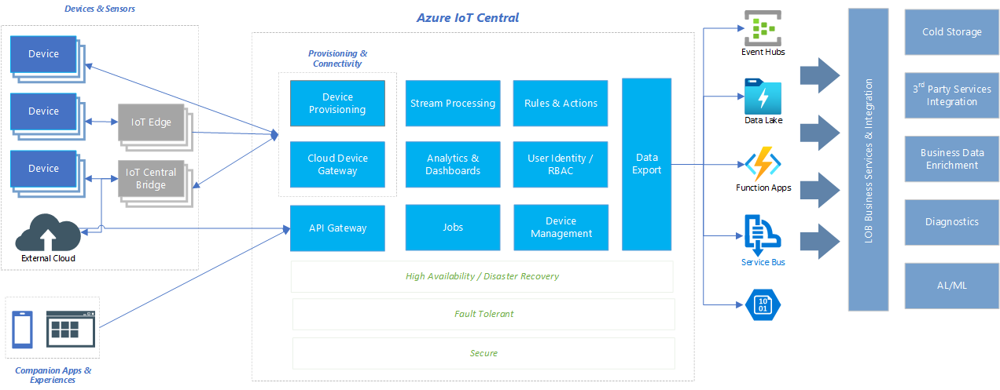
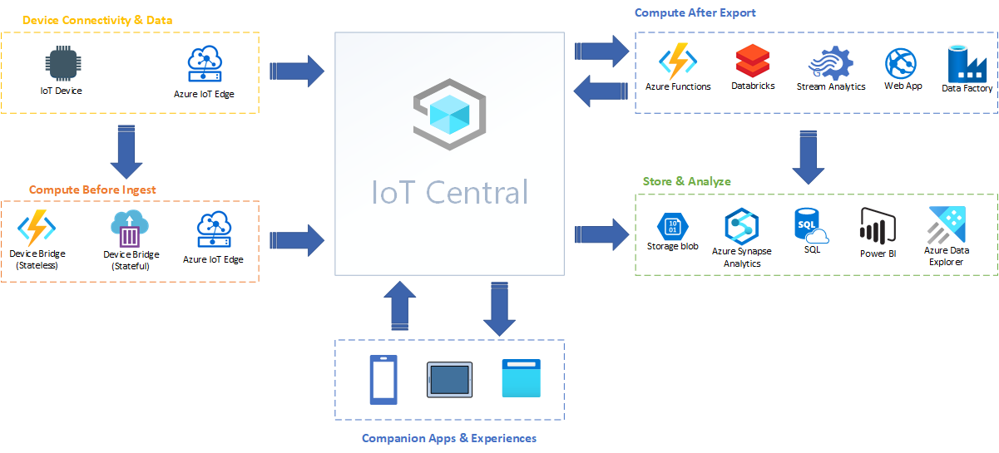

- [Introduction](#introduction)
- [IoT Central Integration Overview](#iot-central-integration-overview)
- [Integration Scenarios](#integration-scenarios)
  - [Companion apps and experiences](#companion-apps-and-experiences)
    - [Authenticating with IoT Central applications using AAD](#authenticating-with-iot-central-applications-using-aad)
    - [Phone as a gateway device to IoT Central](#phone-as-a-gateway-device-to-iot-central)
  - [Device connectivity patterns and scenarios](#device-connectivity-patterns-and-scenarios)
    - [Leverage IoT Hub file transfer](#leverage-iot-hub-file-transfer)
    - [Visualize the device twin representations via Central and IoT Hub](#visualize-the-device-twin-representations-via-central-and-iot-hub)
    - [Connect a device using MQTT on the browser or PWA](#connect-a-device-using-mqtt-on-the-browser-or-pwa)
    - [Connecting a phone as a device](#connecting-a-phone-as-a-device)
    - [Connecting devices using Micro Python](#connecting-devices-using-micro-python)
    - [Connect simulated devices to IoT Central](#connect-simulated-devices-to-iot-central)
    - [Phone as a gateway device to IoT Central](#phone-as-a-gateway-device-to-iot-central-1)
  - [Compute before ingest](#compute-before-ingest)
    - [Transform device telemetry occasionally connected clients via IoT Central Device Bridge (Stateless)](#transform-device-telemetry-occasionally-connected-clients-via-iot-central-device-bridge-stateless)
    - [Connect, control and augment device data using IoT Central Device Bridge (Stateful)](#connect-control-and-augment-device-data-using-iot-central-device-bridge-stateful)
    - [Connect and control non iot-hub capable devices to IoT Central via IoT Central Device Bridge (Stateful)](#connect-and-control-non-iot-hub-capable-devices-to-iot-central-via-iot-central-device-bridge-stateful)
  - [Compute after export](#compute-after-export)
    - [Perform custom computation functions using Azure IoT Central Data Export feature](#perform-custom-computation-functions-using-azure-iot-central-data-export-feature)

# Introduction

Azure IoT Central provides a rich, easy to use IoT Application platform providing rich functionality to accelerate your overall IoT Solution. While IoT Central provides many built in features that help reduce the burden and cost of developing, managing connected IoT devices, IoT Central also exposes a set of rich extensibility and integration points that allow you to leverage IoT Central's features and capabilities in your overall IoT Solutions architecture. 

This guide provides insights into various production ready IoT Central integration guides, patterns and samples that you can utilize as part of your overall IoT Solution architecture.

# IoT Central Integration Overview

# Integration Scenarios

## Companion apps and experiences
The following sections provide guidance and patterns that you can leverage when building companion app experiences leveraging IoT Central. 

### Authenticating with IoT Central applications using AAD
Many companion applications and experiences first need to overcome the hurdle of authenticating and authorizing your users to be able to access IoT data in IoT Central. The following two sample projects provide guidance on how to successfully setup and configure your Azure Active Directory to authenticate and authorize your companion apps and experiences with IoT Central.

- [Setting up an AAD application to work with IoT Central](https://github.com/iot-for-all/iotc-aad-setup)
  
  This guide walks you through how to setup your Azure Active Directory to authenticate your users with IoT Central successfully so that your companion experiences can leverage IoT Central's Public API for accessing iot data in your application(s)

- [Building an companion experience with IoT Central REST API](https://github.com/iot-for-all/iotc-aad-setup)
  
  This sample project provides a blueprint on how to authenticate, authorize and integrate an companion app experience with Azure IoT Central public REST API's.

### Phone as a gateway device to IoT Central

## Device connectivity patterns and scenarios
### Leverage IoT Hub file transfer 
### Visualize the device twin representations via Central and IoT Hub
### Connect a device using MQTT on the browser or PWA
### Connecting a phone as a device
### Connecting devices using Micro Python
### Connect simulated devices to IoT Central
### Phone as a gateway device to IoT Central
    
## Compute before ingest
### Transform device telemetry occasionally connected clients via IoT Central Device Bridge (Stateless)
### Connect, control and augment device data using IoT Central Device Bridge (Stateful)
### Connect and control non iot-hub capable devices to IoT Central via IoT Central Device Bridge (Stateful)

## Compute after export
### Perform custom computation functions using Azure IoT Central Data Export feature

